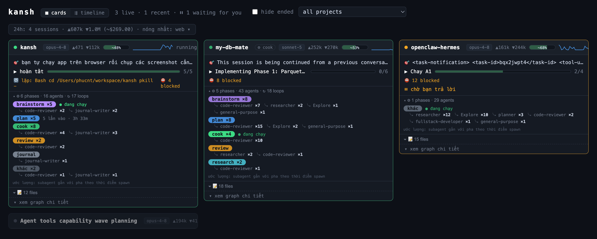
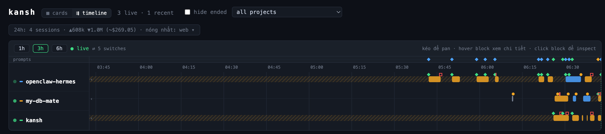

# kansh

**A local, read-only dashboard for your Claude Code sessions.**

Run many Claude Code sessions at once? kansh auto-detects every one on your machine and shows them on a single screen — live — so you stop switching windows to check what each agent is doing.

- 🗂 **One card per session** — mission, progress, health, and the exact question it's waiting on.
- 🧭 **Timeline view** — every session as a swimlane on one shared clock; see cross-project concurrency at a glance.
- 🔀 **Workflow map** — the MK agentic flow (brainstorm → plan → cook → review → journal) with loop counts and the sub-agents each phase spawned.
- ⚠️ **Conflict alerts** — a red banner when two live sessions edit the same file, so agents don't step on each other.
- 🔒 **Read-only & local** — never writes to `~/.claude`, binds to `127.0.0.1` only, no telemetry.



<sub>Cards view — mission, workflow map (phases + sub-agents), health badges, and file activity per session.</sub>

## Quick start

```bash
git clone https://github.com/phuc-nt/kansh
cd kansh
bun install
bun run build
bun run start          # → http://127.0.0.1:4777
```

Requires [Bun](https://bun.sh) ≥ 1.3 and [Claude Code](https://claude.com/claude-code) (macOS). Zero config — no hooks, no plugins.



<sub>Timeline view — every session as a swimlane on one shared clock, with prompt/error/blocked markers, waiting stretches, and an attention ribbon.</sub>

## Documentation

- 📖 **[Installation & Usage](docs/installation-and-usage.md)** — full setup, every feature, configuration, troubleshooting.
- 🏗 **[System Architecture](docs/system-architecture.md)** — how the tailer, parser, liveness, and views fit together.

## License

[MIT](LICENSE) © phuc-nt
